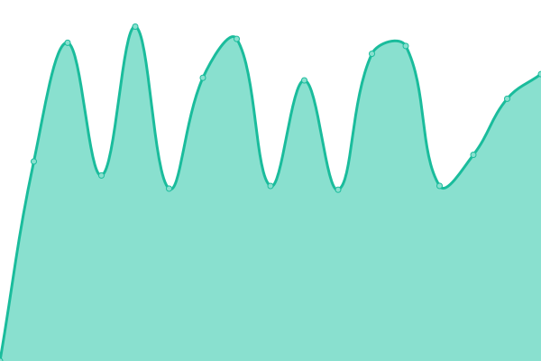

# [📈 Live Status](https://joahn3.github.io/earthlink-upptime): <!--live status--> **🟧 Partial outage**

This repository contains the open-source uptime monitor and status page for [Ionuț Francisc](https://joahn3.github.io/earthlink-upptime), powered by [Upptime](https://github.com/upptime/upptime).

With [Upptime](https://upptime.js.org), you can get your own unlimited and free uptime monitor and status page, powered entirely by a GitHub repository. We use [Issues](https://github.com/joahn3/earthlink-upptime/issues) as incident reports, [Actions](https://github.com/joahn3/earthlink-upptime/actions) as uptime monitors, and [Pages](https://joahn3.github.io/earthlink-upptime) for the status page.

<!--start: status pages-->
<!-- This summary is generated by Upptime (https://github.com/upptime/upptime) -->
<!-- Do not edit this manually, your changes will be overwritten -->
<!-- prettier-ignore -->
| URL | Status | History | Response Time | Uptime |
| --- | ------ | ------- | ------------- | ------ |
|  [EarthLink](https://www.earthlink.ro) | 🟩 Up | [earth-link.yml](https://github.com/joahn3/earthlink-uptime/commits/HEAD/history/earth-link.yml) | 

 1827ms
     
 | 

<a href="https://joahn3.github.io/earthlink-uptime/history/earth-link">100.00%</a>
    

|  [RolCris](https://rolcris.ro) | 🟩 Up | [rol-cris.yml](https://github.com/joahn3/earthlink-uptime/commits/HEAD/history/rol-cris.yml) | 

 3101ms
     
 | 

<a href="https://joahn3.github.io/earthlink-uptime/history/rol-cris">100.00%</a>
    

|  [CEI Sales](https://ceisales.com) | 🟩 Up | [cei-sales.yml](https://github.com/joahn3/earthlink-uptime/commits/HEAD/history/cei-sales.yml) | 

 281ms
     
 | 

<a href="https://joahn3.github.io/earthlink-uptime/history/cei-sales">100.00%</a>
    

|  [Secom](https://www.secom.ro) | 🟩 Up | [secom.yml](https://github.com/joahn3/earthlink-uptime/commits/HEAD/history/secom.yml) | 

 1536ms
     
 | 

<a href="https://joahn3.github.io/earthlink-uptime/history/secom">100.00%</a>
    

|  [Mega Construct](https://www.megaconstruct.ro/) | 🟥 Down | [mega-construct.yml](https://github.com/joahn3/earthlink-uptime/commits/HEAD/history/mega-construct.yml) | 

 0ms
     
 | 

<a href="https://joahn3.github.io/earthlink-uptime/history/mega-construct">0.26%</a>
    

|  [BLT](https://www.blt.ro) | 🟩 Up | [blt.yml](https://github.com/joahn3/earthlink-uptime/commits/HEAD/history/blt.yml) | 

 2586ms
     
 | 

<a href="https://joahn3.github.io/earthlink-uptime/history/blt">100.00%</a>
    

|  [MIBA](https://www.miba.ro) | 🟩 Up | [miba.yml](https://github.com/joahn3/earthlink-uptime/commits/HEAD/history/miba.yml) | 

 832ms
     
 | 

<a href="https://joahn3.github.io/earthlink-uptime/history/miba">100.00%</a>
    

|  [TCC Iasi](https://www.tcc-iasi.ro) | 🟩 Up | [tcc-iasi.yml](https://github.com/joahn3/earthlink-uptime/commits/HEAD/history/tcc-iasi.yml) | 

 1053ms
     
 | 

<a href="https://joahn3.github.io/earthlink-uptime/history/tcc-iasi">100.00%</a>
    

<!--end: status pages-->

[**Visit our status website →**](https://joahn3.github.io/earthlink-upptime)

## 📄 License

- Powered by: [Upptime](https://github.com/upptime/upptime)
- Code: [MIT](./LICENSE) © [Ionuț Francisc](https://joahn3.github.io/earthlink-upptime)
- Data in the `./history` directory: [Open Database License](https://opendatacommons.org/licenses/odbl/1-0/)
