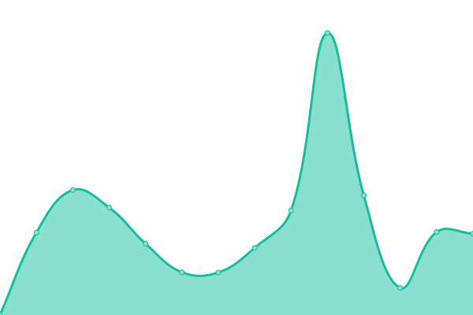
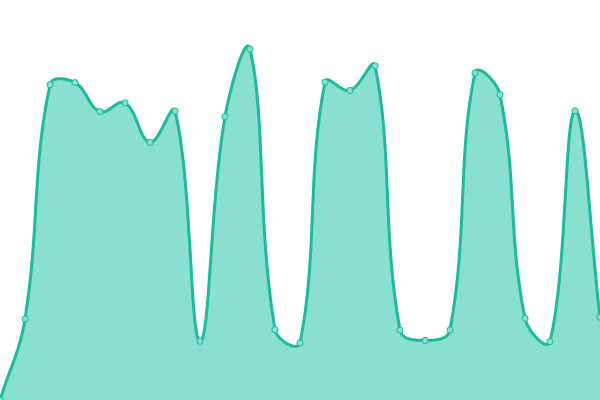

# [📈 Live Status](https://joahn3.github.io/earthlink-uptime): <!--live status--> **🟩 All systems operational**

This repository contains the open-source uptime monitor and status page for [Ionuț Francisc](https://joahn3.github.io/earthlink-upptime), powered by [Upptime](https://github.com/upptime/upptime).

With [Upptime](https://upptime.js.org), you can get your own unlimited and free uptime monitor and status page, powered entirely by a GitHub repository. We use [Issues](https://github.com/joahn3/earthlink-upptime/issues) as incident reports, [Actions](https://github.com/joahn3/earthlink-upptime/actions) as uptime monitors, and [Pages](https://joahn3.github.io/earthlink-upptime) for the status page.

<!--start: status pages-->
<!-- This summary is generated by Upptime (https://github.com/upptime/upptime) -->
<!-- Do not edit this manually, your changes will be overwritten -->
<!-- prettier-ignore -->
| URL | Status | History | Response Time | Uptime |
| --- | ------ | ------- | ------------- | ------ |
|  [earthlink](https://www.earthlink.ro) | 🟩 Up | [earthlink.yml](https://github.com/joahn3/earthlink-uptime/commits/HEAD/history/earthlink.yml) | 

 1833ms
     
 | 

<a href="https://joahn3.github.io/earthlink-uptime/history/earthlink">100.00%</a>
    

|  [GitLab xtelecom](https://git.xtelecom.ro) | 🟩 Up | [git-lab-xtelecom.yml](https://github.com/joahn3/earthlink-uptime/commits/HEAD/history/git-lab-xtelecom.yml) | 

 1265ms
     
 | 

<a href="https://joahn3.github.io/earthlink-uptime/history/git-lab-xtelecom">100.00%</a>
    

|  [earthlink status](https://status.earthlink.ro) | 🟩 Up | [earthlink-status.yml](https://github.com/joahn3/earthlink-uptime/commits/HEAD/history/earthlink-status.yml) | 

 817ms
     
 | 

<a href="https://joahn3.github.io/earthlink-uptime/history/earthlink-status">100.00%</a>
    

|  [earthlink status-backbone](status-backbone.earthlink.ro) | 🟩 Up | [earthlink-status-backbone.yml](https://github.com/joahn3/earthlink-uptime/commits/HEAD/history/earthlink-status-backbone.yml) | 

 1009ms
     
 | 

<a href="https://joahn3.github.io/earthlink-uptime/history/earthlink-status-backbone">100.00%</a>
    

|  [xtelecom Admin](https://admin.xtelecom.ro/login) | 🟩 Up | [xtelecom-admin.yml](https://github.com/joahn3/earthlink-uptime/commits/HEAD/history/xtelecom-admin.yml) | 

 1036ms
     
 | 

<a href="https://joahn3.github.io/earthlink-uptime/history/xtelecom-admin">100.00%</a>
    

|  [RoNet](https://ronet.xtelecom.ro/) | 🟩 Up | [ro-net.yml](https://github.com/joahn3/earthlink-uptime/commits/HEAD/history/ro-net.yml) | 

 1099ms
     
 | 

<a href="https://joahn3.github.io/earthlink-uptime/history/ro-net">100.00%</a>
    

|  [Tsty](https://www.tsty.ro) | 🟩 Up | [tsty.yml](https://github.com/joahn3/earthlink-uptime/commits/HEAD/history/tsty.yml) | 

 1597ms
     
 | 

<a href="https://joahn3.github.io/earthlink-uptime/history/tsty">100.00%</a>
    

|  [Tsty ERP](https://app.tsty.ro) | 🟩 Up | [tsty-erp.yml](https://github.com/joahn3/earthlink-uptime/commits/HEAD/history/tsty-erp.yml) | 

 1097ms
     
 | 

<a href="https://joahn3.github.io/earthlink-uptime/history/tsty-erp">100.00%</a>
    

|  [Laravel Enso](https://laravel-enso.com) | 🟩 Up | [laravel-enso.yml](https://github.com/joahn3/earthlink-uptime/commits/HEAD/history/laravel-enso.yml) | 

 1686ms
     
 | 

<a href="https://joahn3.github.io/earthlink-uptime/history/laravel-enso">100.00%</a>
    

|  [Laravel Enso Docs](https://docs.laravel-enso.com) | 🟩 Up | [laravel-enso-docs.yml](https://github.com/joahn3/earthlink-uptime/commits/HEAD/history/laravel-enso-docs.yml) | 

 455ms
     
 | 

<a href="https://joahn3.github.io/earthlink-uptime/history/laravel-enso-docs">100.00%</a>
    

|  [Rolcris](https://rolcris.ro) | 🟩 Up | [rolcris.yml](https://github.com/joahn3/earthlink-uptime/commits/HEAD/history/rolcris.yml) | 

 3501ms
     
 | 

<a href="https://joahn3.github.io/earthlink-uptime/history/rolcris">100.00%</a>
    

|  [Rolcris ERP](https://erp.rolcris.ro) | 🟩 Up | [rolcris-erp.yml](https://github.com/joahn3/earthlink-uptime/commits/HEAD/history/rolcris-erp.yml) | 

 1024ms
     
 | 

<a href="https://joahn3.github.io/earthlink-uptime/history/rolcris-erp">100.00%</a>
    

|  [CRM Rolcris](https://crm.rolcris.ro/login) | 🟩 Up | [crm-rolcris.yml](https://github.com/joahn3/earthlink-uptime/commits/HEAD/history/crm-rolcris.yml) | 

 996ms
     
 | 

<a href="https://joahn3.github.io/earthlink-uptime/history/crm-rolcris">100.00%</a>
    

|  [CEI Sales](https://ceisales.com) | 🟩 Up | [cei-sales.yml](https://github.com/joahn3/earthlink-uptime/commits/HEAD/history/cei-sales.yml) | 

 349ms
     
 | 

<a href="https://joahn3.github.io/earthlink-uptime/history/cei-sales">98.92%</a>
    

|  [CEI Sales App](https://app.ceisales.com/login) | 🟩 Up | [cei-sales-app.yml](https://github.com/joahn3/earthlink-uptime/commits/HEAD/history/cei-sales-app.yml) | 

 213ms
     
 | 

<a href="https://joahn3.github.io/earthlink-uptime/history/cei-sales-app">98.94%</a>
    

|  [CEI Sales Wiki](https://wiki.ceisales.com/login) | 🟩 Up | [cei-sales-wiki.yml](https://github.com/joahn3/earthlink-uptime/commits/HEAD/history/cei-sales-wiki.yml) | 

 202ms
     
 | 

<a href="https://joahn3.github.io/earthlink-uptime/history/cei-sales-wiki">98.96%</a>
    

|  [KM Digital](https://k-m.com) | 🟩 Up | [km-digital.yml](https://github.com/joahn3/earthlink-uptime/commits/HEAD/history/km-digital.yml) | 

 322ms
     
 | 

<a href="https://joahn3.github.io/earthlink-uptime/history/km-digital">100.00%</a>
    

|  [Secom](https://www.secom.ro) | 🟩 Up | [secom.yml](https://github.com/joahn3/earthlink-uptime/commits/HEAD/history/secom.yml) | 

 1162ms
     
 | 

<a href="https://joahn3.github.io/earthlink-uptime/history/secom">100.00%</a>
    

|  [BLT](https://www.blt.ro) | 🟩 Up | [blt.yml](https://github.com/joahn3/earthlink-uptime/commits/HEAD/history/blt.yml) | 

 3764ms
     
 | 

<a href="https://joahn3.github.io/earthlink-uptime/history/blt">97.42%</a>
    

|  [MIBA](https://www.miba.ro) | 🟩 Up | [miba.yml](https://github.com/joahn3/earthlink-uptime/commits/HEAD/history/miba.yml) | 

 1064ms
     
 | 

<a href="https://joahn3.github.io/earthlink-uptime/history/miba">100.00%</a>
    

|  [MegaConstruct](https://www.megaconstruct.ro) | 🟩 Up | [mega-construct.yml](https://github.com/joahn3/earthlink-uptime/commits/HEAD/history/mega-construct.yml) | 

 1158ms
     
 | 

<a href="https://joahn3.github.io/earthlink-uptime/history/mega-construct">100.00%</a>
    

|  [TCC Iasi](https://www.tcc-iasi.ro) | 🟩 Up | [tcc-iasi.yml](https://github.com/joahn3/earthlink-uptime/commits/HEAD/history/tcc-iasi.yml) | 

 1350ms
     
 | 

<a href="https://joahn3.github.io/earthlink-uptime/history/tcc-iasi">100.00%</a>
    

|  [Felix Telecom](https://www.felixtelecom.ro) | 🟩 Up | [felix-telecom.yml](https://github.com/joahn3/earthlink-uptime/commits/HEAD/history/felix-telecom.yml) | 

 4020ms
     
 | 

<a href="https://joahn3.github.io/earthlink-uptime/history/felix-telecom">94.97%</a>
    

|  [Paicu & Sons Consulting](https://paicucons.ro) | 🟩 Up | [paicu-and-sons-consulting.yml](https://github.com/joahn3/earthlink-uptime/commits/HEAD/history/paicu-and-sons-consulting.yml) | 

 1037ms
     
 | 

<a href="https://joahn3.github.io/earthlink-uptime/history/paicu-and-sons-consulting">100.00%</a>
    

|  [Amoobi](https://www.amoobi.com) | 🟩 Up | [amoobi.yml](https://github.com/joahn3/earthlink-uptime/commits/HEAD/history/amoobi.yml) | 

 2686ms
     
 | 

<a href="https://joahn3.github.io/earthlink-uptime/history/amoobi">100.00%</a>
    

|  [GlobStar 1](https://globstar.ro) | 🟩 Up | [glob-star-1.yml](https://github.com/joahn3/earthlink-uptime/commits/HEAD/history/glob-star-1.yml) | 

 2456ms
     
 | 

<a href="https://joahn3.github.io/earthlink-uptime/history/glob-star-1">100.00%</a>
    

|  [Ted Electric EU](https://www.tedelectric.eu) | 🟩 Up | [ted-electric-eu.yml](https://github.com/joahn3/earthlink-uptime/commits/HEAD/history/ted-electric-eu.yml) | 

 2831ms
     
 | 

<a href="https://joahn3.github.io/earthlink-uptime/history/ted-electric-eu">100.00%</a>
    

|  [GP Batteries](https://www.gpbatteries.ro) | 🟩 Up | [gp-batteries.yml](https://github.com/joahn3/earthlink-uptime/commits/HEAD/history/gp-batteries.yml) | 

 1174ms
     
 | 

<a href="https://joahn3.github.io/earthlink-uptime/history/gp-batteries">100.00%</a>
    

|  [Globstar B2B](https://b2b.globstar.ro) | 🟩 Up | [globstar-b2-b.yml](https://github.com/joahn3/earthlink-uptime/commits/HEAD/history/globstar-b2-b.yml) | 

 1380ms
     
 | 

<a href="https://joahn3.github.io/earthlink-uptime/history/globstar-b2-b">100.00%</a>
    

|  [Globstar Service UPS](https://serviceups.globstar.ro) | 🟩 Up | [globstar-service-ups.yml](https://github.com/joahn3/earthlink-uptime/commits/HEAD/history/globstar-service-ups.yml) | 

 1840ms
     
 | 

<a href="https://joahn3.github.io/earthlink-uptime/history/globstar-service-ups">100.00%</a>
    

<!--end: status pages-->

[**Visit our status website →**](https://joahn3.github.io/earthlink-uptime)

## 📄 License

- Powered by: [Upptime](https://github.com/upptime/upptime)
- Code: [MIT](./LICENSE) © [Ionuț Francisc](https://joahn3.github.io/earthlink-uptime)
- Data in the `./history` directory: [Open Database License](https://opendatacommons.org/licenses/odbl/1-0/)
